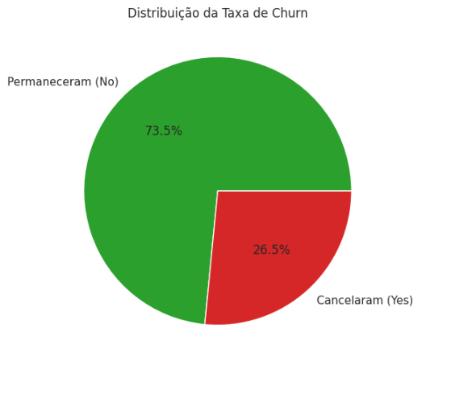
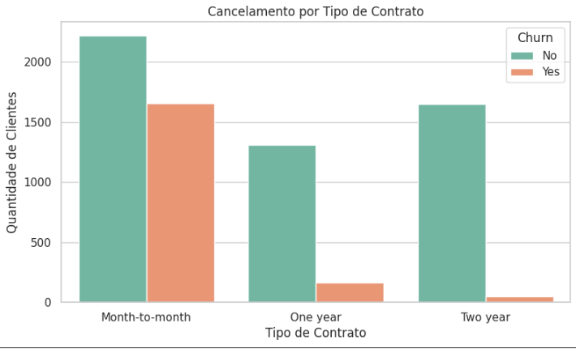
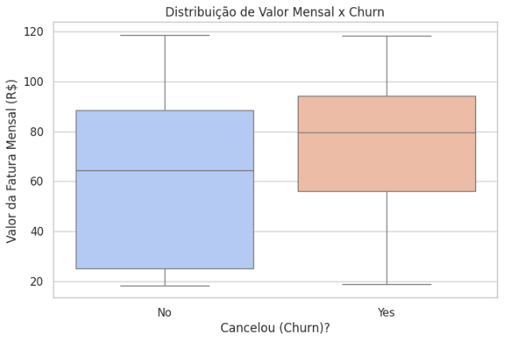

# 📊 Análise Exploratória de Dados (EDA) — Churn de Clientes (Telecom)

Projeto de portfólio em **Python** focado em Análise Exploratória de Dados (EDA), aplicado a um problema real de negócio: entender **por que os clientes de uma empresa de telecomunicações estão cancelando o serviço (churn)**.

## 🎯 Objetivo do Projeto

A partir de um dataset público de clientes de telecom, o projeto busca responder:

- Qual é a taxa geral de cancelamento (Churn Rate) da empresa?
- Existe relação entre o tipo de contrato (mensal vs. anual) e o cancelamento?
- Qual o impacto do tempo de contrato (*tenure*) e do valor da fatura mensal no cancelamento?
- Quais serviços adicionais (suporte técnico, segurança online) mais reduzem a evasão de clientes?

## 🗂️ Sobre o Dataset

- **Nome:** Telco Customer Churn
- **Fonte:** [IBM Sample Data / Kaggle](https://raw.githubusercontent.com/IBM/telco-customer-churn-on-icp4d/master/data/Telco-Customer-Churn.csv)
- **Tamanho:** ~7.000 linhas, com informações demográficas, de contrato e de uso dos clientes

## 🛠️ Ferramentas e Bibliotecas

- Python 3
- Pandas — manipulação e limpeza de dados
- Matplotlib e Seaborn — visualização de dados
- Jupyter Notebook / Google Colab

## 📊 Visualizações

**Taxa geral de churn**



**Churn por tipo de contrato**



**Fatura mensal vs. churn**



## 📈 Principais Insights

- Clientes com **contrato mensal (Month-to-month)** apresentam uma quantidade de cancelamentos muito maior do que clientes com contrato de 1 ou 2 anos.
- Clientes que cancelam tendem a pagar uma **fatura mensal mais alta**, indicado pela mediana mais elevada no boxplot de `MonthlyCharges`.
- A oferta de **serviços adicionais** (como suporte técnico) está associada a uma menor taxa de evasão.

## 💼 Recomendações de Negócio

1. **Incentivar migração de contrato** — oferecer descontos para clientes de contrato mensal migrarem para planos anuais, que têm churn muito menor.
2. **Atenção a clientes de fatura alta** — criar um programa de retenção para clientes com `MonthlyCharges` acima da média.
3. **Reforçar suporte técnico** — oferecer o serviço com período de teste grátis, já que sua ausência está associada a maior cancelamento.

## 🚧 Limitações e Próximos Passos

Esta é uma análise exploratória inicial, baseada em observação visual dos gráficos. Os próximos passos incluem:

- Testar significância estatística das relações encontradas (ex: teste qui-quadrado entre `Contract` e `Churn`)
- Construir um modelo preditivo de classificação para antecipar o cancelamento

## 🗄️ Estrutura do Repositório

```
eda-churn-clientes/
├── README.md                     # Este arquivo
├── EDA_Churn_Clientes.ipynb      # Notebook com todo o código, gráficos e conclusões
└── img/                          # Prints dos gráficos exibidos no README
    ├── taxa_churn.png
    ├── churn_por_contrato.png
    └── fatura_mensal_x_churn.png
```
## ▶️ Como Executar

1. Clone este repositório:
   ```bash
   git clone https://github.com/seu-usuario/eda-churn-clientes.git
   ```
2. Abra o arquivo `EDA_Churn_Clientes.ipynb` no [Google Colab](https://colab.research.google.com) ou no Jupyter Notebook local.
3. Execute as células em ordem — o dataset é carregado automaticamente via URL, não é preciso baixar nada manualmente.

## 📫 Contato

Feito por **[Aiman Sidaoui]**

`#Python` `#DataScience` `#Pandas` `#EDA` `#DataAnalytics` `#Portfolio`
